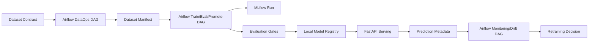

# UNet3D Suite For Medical Segmentation

[](https://www.python.org/)
[](LICENSE)


Production-minded 3D medical image segmentation built around a PyTorch UNet3D. This repository is not just a training script: it includes a FastAPI inference service, a Streamlit review console, Dockerized local deployment, test coverage, explicit DataOps contracts, and MLOps hooks for tracking, monitoring, drift checks, retraining and rollback decisions.

## Quick Navigation
- [Visual Results](#visual-results)
- [Repository Structure](#repository-structure)
- [Project Snapshot](#project-snapshot)
- [Quickstart](#quickstart)
- [Local-first MLOps Platform](#local-first-mlops-platform)
- [Airflow-Orchestrated Local MLOps](#airflow-orchestrated-local-mlops)
- [API Surface](#api-surface)
- [Data and MLOps](#data-and-mlops)

## Project Snapshot
- **Model**: `UNet3D` for volumetric medical segmentation.
- **Framework**: `PyTorch`.
- **Data format**: `.nii` and `.nii.gz` NIfTI volumes.
- **Serving layer**: `FastAPI` with schemas, health probes, model metadata and binary mask download.
- **Review interface**: `Streamlit` for slice inspection, overlays, histograms and inference comparison.
- **Ops baseline**: test suite, CLI scripts, split Docker images, environment-based configuration and runtime monitoring.
- **Data foundation**: source metadata, contracts, manifests, registry and quality checks for the canonical dataset.
- **Local platform layer**: Makefile commands, `.env.example`, MLflow, local model registry, promotion/rollback CLIs, Prometheus metrics, Grafana dashboard and Airflow DAG skeletons.

## Why This Repo Works As A Portfolio Project
- It solves a real 3D medical imaging task instead of a 2D toy demo.
- It shows the full path from training to serving to human review.
- The API looks like a deployable product, not a notebook wrapper.
- The data layer is explicit, versioned and contract-driven.
- The MLOps layer already includes MLflow integration, drift analysis and operational policies.
- The repo is easy to run locally through scripts, tests and Docker.

> Start with the outputs. The section below is intentionally near the top because the visual evidence is one of the strongest parts of the project.


<h2 align="center"> Some Visual Results</h2>

<table align="center">
  <!-- Top row: smaller, context metrics -->
  <tr>
    <td align="center" width="50%">
      <b>IoU by class (validation)</b><br/>
      
    </td>
    <td align="center" width="50%">
      <b>IoU across volume (validation)</b><br/>
      
    </td>
  </tr>

  <!-- Second row: larger, main qualitative results -->
  <tr>
    <td align="center" colspan="2">
      <b>Sample predictions</b><br/>
      
    </td>
  </tr>

  <tr>
    <td align="center" colspan="2">
      <b>Error overlays</b><br/>
      
    </td>
  </tr>
</table>


## Repository Structure
```text
├─ app/                     # Streamlit review console
├─ airflow/                 # Local Airflow DAGs and runtime folders
├─ artifacts/               # Local ignored model, registry, prediction and feedback artifacts
├─ data/                    # Dataset layout, manifests, registry, ingestion and preprocessing
├─ docker/                  # Dedicated Dockerfiles for API and Streamlit
├─ experiments/             # Qualitative and quantitative results
├─ monitoring/              # Prometheus scrape config and Grafana dashboard provisioning
├─ requirements/            # Dependency profiles: base, api, app, dev
├─ schemas/                 # MLOps JSON schemas for evaluation and review feedback
├─ scripts/                 # CLI helpers for API, app, tests, Docker, data and drift
├─ src/
│  ├─ api/                  # FastAPI app, schemas, settings, inference service
│  ├─ mlops/                # Tracking, registry, metrics, feedback, drift and retraining logic
│  ├─ model/                # UNet3D architecture and blocks
│  ├─ model_inference.py/   # Analysis and qualitative utilities
│  └─ training/             # Training loop and metrics
├─ tests/                   # API, data and MLOps smoke tests
├─ docker-compose.yml       # Multi-service local stack
├─ Makefile                 # Local reproducibility and platform commands
├─ model.yaml               # Model card and serving metadata
├─ requirements.txt         # Full development dependencies
└─ Dockerfile               # Backward-compatible API image build
```


## Quickstart
### 1. Create the local environment
```bash
python3 -m venv .venv
source .venv/bin/activate
pip install --upgrade pip
pip install -r requirements/dev.txt
cp .env.example .env
```

Or use the Makefile:
```bash
make setup
cp .env.example .env
make check-env
```

### 2. Run smoke tests
The smoke tests do not require CUDA or trained UNet3D weights. API tests use dummy services where needed.
```bash
make test
```

### 3. Run the API
```bash
python scripts/run_api.py \
  --reload \
  --model-path /absolute/path/to/unet3d_best.pt
```

### 4. Run the Streamlit review app
```bash
python scripts/run_app.py \
  --api-url http://localhost:8000 \
  --model-path /absolute/path/to/unet3d_best.pt
```

### 5. Run the local Docker stack
```bash
make docker-up
```

This starts:
- `api` on `http://localhost:8000`
- `streamlit` on `http://localhost:8501`

Stop the stack with:
```bash
make docker-down
```

### 6. Run local platform services
```bash
make mlflow-up
make airflow-up
make prometheus-up
```

Service URLs:
- FastAPI: `http://localhost:8000`
- Streamlit: `http://localhost:8501`
- MLflow: `http://localhost:5000`
- Airflow: `http://localhost:8080`
- Prometheus: `http://localhost:9090`
- Grafana: `http://localhost:3000`

## Local-first MLOps Platform
This repository implements a local-first MLOps workflow for 3D medical image segmentation. Beyond model training, it includes dataset contracts, dataset versioning, MLflow experiment tracking, local model registry semantics, Dockerized inference, Streamlit review, Prometheus/Grafana observability, Airflow orchestration, drift detection, and policy-driven retraining/rollback decisions.

The project intentionally avoids managed cloud services in its current version to make the complete lifecycle reproducible on a local workstation.

```text
DataOps -> Training -> MLflow -> Evaluation -> Registry -> FastAPI -> Monitoring -> Drift -> Retraining Policy -> Airflow
```

### Local platform commands
```bash
make check-env        # verify Python, dependencies and local directories
make mlflow-up        # start local MLflow at localhost:5000
make airflow-up       # start local Airflow at localhost:8080
make prometheus-up    # start Prometheus and Grafana
make smoke-docker     # probe local stack endpoints
```

### Local registry and release governance
The local model registry uses filesystem-backed metadata under `artifacts/registry/` and model packages under `artifacts/models/`.

Promotion and rollback are explicit commands:
```bash
python scripts/promote_model.py \
  --candidate-version v0.2.0 \
  --require-eval-pass \
  --write-deployment-record

python scripts/rollback_model.py --to previous
```

Each model package is expected to include `model_package.yaml` with dataset lineage, config hashes, MLflow run ID, checkpoint path, evaluation report path and deployment status.

## Airflow-Orchestrated Local MLOps
Apache Airflow is the local orchestration layer for the complete MLOps lifecycle:

1. Dataset validation and registration.
2. Training, evaluation, and governed promotion.
3. Monitoring, drift assessment, and retraining decisions.
4. Full local lifecycle demo.

| DAG | Purpose | Output |
|---|---|---|
| `dataset_validation_registration_dag` | Validates and registers dataset versions | Manifest + data quality report |
| `train_evaluate_promote_dag` | Trains/evaluates candidate and promotes if gates pass | Candidate package + registry update |
| `monitoring_drift_retraining_dag` | Evaluates deployed model health | Retraining/rollback assessment |
| `local_full_lifecycle_demo_dag` | Runs the full lifecycle locally | Portfolio-grade demo summary |



Airflow commands:
```bash
make airflow-up
make airflow-load-vars
make airflow-init-connections
make airflow-list-dags
make airflow-test-demo
```

CPU-safe local demo:
```bash
make mlops-demo
```

## End-to-End Workflow
```text
NIfTI volume
   ->
preprocessing
   - percentile clipping
   - min-max normalization
   - padding to multiples of 16
   ->
UNet3D inference
   ->
predicted mask
   ->
FastAPI JSON response / NIfTI download / Streamlit visual QA
```

## API Surface
OpenAPI docs are available at `http://localhost:8000/docs` and `http://localhost:8000/redoc`.

### Platform and health
- `GET /` returns service discovery metadata.
- `GET /health/live` exposes liveness.
- `GET /health/ready` validates readiness, including model/checkpoint status.
- `GET /api/v1/config` returns the active runtime configuration.

### Model management
- `GET /api/v1/model` returns model metadata from `model.yaml` and runtime settings.
- `POST /api/v1/model/reload` reloads the checkpoint without restarting the API.

### Inference endpoints
- `POST /api/v1/predictions` returns JSON inference metadata, runtime breakdown, spacing, orientation and histogram information.
- `POST /api/v1/predictions/download` returns the predicted mask as `.nii.gz`.
- `POST /v1/predict` remains available as a legacy compatibility route.

Example JSON inference:
```bash
curl -X POST "http://localhost:8000/api/v1/predictions" \
  -H "accept: application/json" \
  -F "file=@/path/to/volume.nii.gz"
```

Example mask download:
```bash
curl -X POST "http://localhost:8000/api/v1/predictions/download" \
  -F "file=@/path/to/volume.nii.gz" \
  -o mask.nii.gz
```

## Streamlit Review App
The review app supports two main workflows:
- **API deployment mode**: calls the live FastAPI backend, checks readiness and downloads the predicted mask.
- **Local checkpoint mode**: runs the same inference service locally for quick validation on the same machine.

Each inference session includes:
- slice-by-slice browsing on any axis,
- image, mask and overlay visualization,
- runtime metadata and request identifiers,
- class histograms and prediction metadata,
- direct `.nii.gz` download for the predicted mask.

## Docker Deployment
The repository ships separate images for the backend and the review interface.

Raw image builds:
```bash
docker build -f docker/Dockerfile.api -t unet3d-medseg-api .
docker build -f docker/Dockerfile.streamlit -t unet3d-medseg-streamlit .
```

Compose profiles keep local services optional:
```bash
docker compose --profile api up
docker compose --profile app up
docker compose --profile mlflow up
docker compose --profile airflow up
docker compose --profile monitoring up
docker compose --profile all up
```

## Configuration
Environment variables use the `UNET3D_` prefix. The most relevant ones are:
- `UNET3D_MODEL_PATH`
- `UNET3D_DEVICE`
- `UNET3D_DEFAULT_THRESHOLD`
- `UNET3D_PAD_MULTIPLE`
- `UNET3D_CLIP_PERCENTILES`
- `UNET3D_ALLOW_ORIGINS`
- `UNET3D_PRELOAD_MODEL`
- `UNET3D_ARTIFACT_ROOT`
- `UNET3D_DATA_ROOT`
- `UNET3D_MLFLOW_TRACKING_URI`
- `UNET3D_PROMETHEUS_ENABLED`
- `UNET3D_PREDICTION_LOG_PATH`
- `UNET3D_REVIEW_FEEDBACK_PATH`

See `src/api/settings.py` for the full runtime configuration contract.

## Data and MLOps
### Data foundation
The project treats data as a first-class asset through the root `data/` package:
- `data/raw/` for immutable source drops.
- `data/external/` for downloaded archives.
- `data/interim/` for temporary or review-stage artifacts.
- `data/processed/` for standardized training-ready volumes.
- `data/manifests/` for JSON manifests with hashes and lineage.
- `data/registry/datasets.yaml` for registered dataset versions.

For **Medical Segmentation Decathlon Task04 Hippocampus**, the repo already includes:
- source metadata in `data/sources/task04_hippocampus.yaml`,
- a data contract in `data/contracts/task04_hippocampus.contract.yaml`,
- a schema for the official `dataset.json`,
- a schema for dataset manifests,
- a schema for the dataset registry,
- quality validation and version registration pipelines.

Task04 preparation:
```bash
python scripts/run_task04_dataops.py \
  --dataset-version 2026.03.21
```

Manual manifest registration:
```bash
python scripts/run_data_registry.py \
  --images-dir data/processed/task04_hippocampus/2026.03.21/imagesTr \
  --labels-dir data/processed/task04_hippocampus/2026.03.21/labelsTr \
  --dataset-name task04_hippocampus \
  --version 2026.03.21 \
  --manifest-out data/manifests/task04_hippocampus_2026.03.21.json
```

### MLflow tracking and packaging
`src/mlops/mlflow_tracking.py` wraps the training loop without replacing it. Each run can log:
- hyperparameters and tags,
- train and validation metrics per epoch,
- best checkpoint artifacts,
- dataset manifests,
- `model.yaml`,
- packaging manifests,
- serving files and Docker packaging files,
- data contracts and source metadata.

### Drift, retraining and rollback
The project does not reduce operations to drift alone.

It already includes:
- drift baselining and evaluation for deployment batches,
- periodic retraining policies,
- KPI-driven retraining decisions,
- rollback rules for runtime regressions,
- runtime monitoring endpoints exposed by the API.

Drift baseline example:
```bash
python scripts/run_drift_check.py baseline \
  --images-dir data/processed/task04_hippocampus/2026.03.21/imagesTr \
  --dataset-version 2026.03.21 \
  --output-path data/manifests/task04_hippocampus_drift_baseline.json
```

### Deployment monitoring
The serving layer explicitly tracks:
- latency,
- throughput,
- error rate,
- per-endpoint behavior,
- CPU and memory usage,
- GPU memory usage when available,
- estimated cost per 1000 requests.

Useful monitoring endpoints:
- `GET /api/v1/monitoring/runtime`
- `GET /api/v1/monitoring/policy`
- `GET /api/v1/monitoring/retraining-assessment`
- `GET /metrics`

For the operational summary, see `docs/mlops_playbook.md`.


## Testing
The `tests/` suite currently covers:
- settings validation,
- dataset pairing, loading and manifest versioning,
- dataset quality contracts and Task04 source metadata,
- MLflow tracking hooks, retraining policy logic and deployment drift evaluation,
- inference-service metadata and padding behavior,
- FastAPI routes for health, metadata, reload, prediction and file validation.

This gives the repository a solid engineering baseline before adding CI/CD, model registries, cloud deployment and full production observability.

## License
MIT License. You are free to use, modify, and distribute with attribution and without warranty.

## Support
For issues or improvements, open a ticket or reach the maintainers listed in `model.yaml`.
